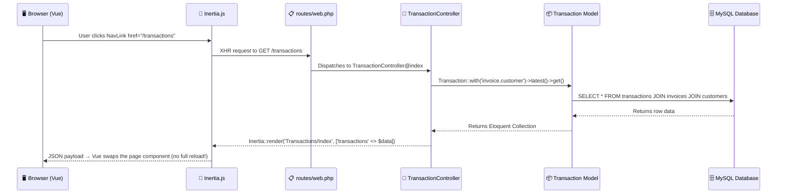
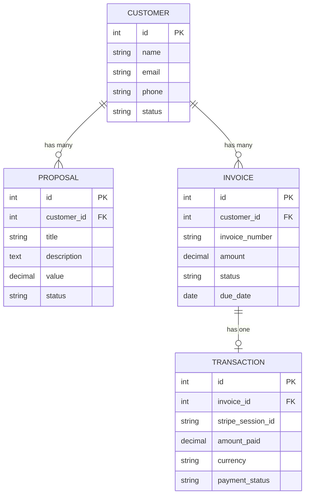

# 🏗️ CRM Application — Architectural Deep-Dive & System Guide

> **Purpose:** This document is your "map" to truly understanding the CRM codebase you built. Every concept is tied to a real file in your project, with analogies to make the abstract concrete.

---

## SECTION 1: THE BIG PICTURE & FOLDER GEOGRAPHY

### 1.1 — The Two Worlds of Your Application

Think of your CRM as a **restaurant with two kitchens:**

- **The Back Kitchen** (`app/`, `routes/`, `config/`, `database/`) — This is **PHP/Laravel**. It talks to MySQL, Stripe, and Mailtrap. It decides _what data exists_ and _what rules to enforce_. Customers never see this kitchen.

- **The Front Kitchen** (`resources/js/`) — This is **Vue 3**. It decides _how things look_ on screen — the tables, buttons, modals, and animations the admin interacts with. It has zero direct access to the database.

**The Bridge Between Them: Inertia.js**

In a traditional app, these two kitchens talk through a REST API (JSON endpoints). Inertia.js eliminates that entirely. Instead, your Laravel controller _directly hands_ a PHP array to a Vue component — no `/api/customers` endpoint, no `fetch()` calls, no JSON serialization you manage yourself. It's like having a waiter who speaks both languages fluently.

```
┌─────────────────────┐        Inertia.js         ┌──────────────────────┐
│   LARAVEL (PHP)     │ ◄──── "The Waiter" ─────► │    VUE 3 (JS)        │
│                     │                            │                      │
│ • Routes            │   Carries data both ways   │ • Pages/             │
│ • Controllers       │   without REST APIs        │ • Layouts/           │
│ • Models            │                            │ • Components/        │
│ • Migrations        │                            │                      │
│ • Mailables         │                            │                      │
└─────────────────────┘                            └──────────────────────┘
         │                                                   │
         ▼                                                   ▼
   MySQL Database                                      User's Browser
   Stripe API                                          (What they see)
   Mailtrap SMTP
```

### 1.2 — The Annotated Directory Tree

Here is every vital file we touched to build this CRM, with a plain-English job description:

```
crm-project/
│
├── routes/
│   └── web.php ................ "The reception desk" — Maps every URL to a controller method
│   └── auth.php ............... "The security checkpoint" — Login, register, password reset routes
│   └── console.php ............ "The maintenance hatch" — CLI commands like crm:test-gateways
│
├── app/
│   ├── Http/
│   │   ├── Controllers/
│   │   │   ├── CustomerController.php ...... "The customer desk clerk" — CRUD for client records
│   │   │   ├── ProposalController.php ...... "The deals manager" — Create/list/delete proposals
│   │   │   ├── InvoiceController.php ....... "The billing clerk" — Create/list/delete invoices
│   │   │   ├── StripePaymentController.php . "The payment cashier" — Stripe sessions + email dispatch
│   │   │   ├── TransactionController.php ... "The auditor" — Displays the payment audit trail
│   │   │   └── Auth/ ....................... "The bouncers" — Registration, login, password logic
│   │   │
│   │   └── Middleware/
│   │       └── HandleInertiaRequests.php ... "The universal translator" — Shares auth/flash data to ALL Vue pages
│   │
│   ├── Models/
│   │   ├── User.php ............. "The employee badge" — Represents a CRM admin user
│   │   ├── Customer.php ......... "The client file" — Represents a business customer
│   │   ├── Proposal.php ......... "The deal card" — A sales proposal tied to a customer
│   │   ├── Invoice.php .......... "The bill" — An invoice tied to a customer
│   │   └── Transaction.php ...... "The receipt" — A payment audit log tied to an invoice
│   │
│   ├── Mail/
│   │   ├── CustomerInvoiceMail.php .. "The invoice envelope" — Builds the HTML payment email
│   │   └── WelcomeNewUser.php ....... "The welcome card" — Builds the onboarding email
│   │
│   ├── Events/
│   │   └── UserRegistered.php ....... "The announcement" — Fires when a new user signs up
│   │
│   ├── Listeners/
│   │   └── SendWelcomeEmail.php ..... "The mail clerk" — Hears the announcement, sends the welcome email
│   │
│   └── Providers/
│       └── EventServiceProvider.php . "The PA system wiring" — Connects events to their listeners
│
├── database/
│   └── migrations/
│       ├── create_users_table.php ........... Blueprint for the `users` table
│       ├── create_customers_table.php ....... Blueprint for the `customers` table
│       ├── create_proposals_table.php ....... Blueprint for the `proposals` table
│       ├── create_invoices_table.php ........ Blueprint for the `invoices` table
│       └── create_transactions_table.php .... Blueprint for the `transactions` audit table
│
├── resources/js/
│   ├── Layouts/
│   │   └── AuthenticatedLayout.vue .. "The building shell" — Nav bar, user menu, wraps every page
│   │
│   └── Pages/
│       ├── Dashboard.vue ............. The landing page after login
│       ├── Customers/
│       │   └── Index.vue ............. Customer table + Create/Edit modals (all-in-one)
│       ├── Proposals/
│       │   ├── Index.vue ............. Proposals table with pipeline stats dashboard
│       │   └── Create.vue ............ Form to draft a new proposal
│       ├── Invoices/
│       │   ├── Index.vue ............. Invoice table with billing stats + email action
│       │   └── Create.vue ............ Form to create a new invoice
│       └── Transactions/
│           └── Index.vue ............. Read-only audit ledger of all Stripe payments
│
├── resources/views/emails/
│   ├── welcome.blade.php ............ HTML template for the welcome onboarding email
│   └── invoice.blade.php ............ HTML template for the Stripe payment email
│
├── config/
│   └── services.php ................. Third-party API keys (Stripe, Mailgun, SES)
│
└── .env ............................. Your secrets vault (DB credentials, Stripe keys, SMTP passwords)
```

> [!TIP]
> **The golden rule:** Laravel's `app/` folder owns the _logic and data_. Vue's `resources/js/Pages/` folder owns the _presentation_. They never directly import each other — Inertia.js is the courier running between them.

---

## SECTION 2: THE ROUTING MAP & CONTROLLER TRAFFIC COP

### 2.1 — The Lifecycle of a Click: From Mouse to Database and Back

Let's trace exactly what happens when an admin clicks **"Transactions"** in the nav bar. Every step has a real file behind it.



Here's each step in plain English:

---

**Step 1 — The Click** ([AuthenticatedLayout.vue L41-L43](file:///Users/isulailleperuma/Desktop/Weblook/CRM---Laravel-Project/crm-project/resources/js/Layouts/AuthenticatedLayout.vue#L41-L43))

```html
<NavLink
    :href="route('transactions.index')"
    :active="route().current('transactions.*')"
>
    Transactions
</NavLink>
```

The `route('transactions.index')` helper generates the URL `/transactions`. When clicked, **Inertia intercepts this click** — it does NOT trigger a traditional browser navigation. Instead, it fires an **XHR (AJAX) request** to `/transactions` with a special `X-Inertia` header.

> **Analogy:** Instead of leaving the restaurant to go to another building, the waiter just brings you a new menu at your same table.

---

**Step 2 — The Router** ([web.php L43](file:///Users/isulailleperuma/Desktop/Weblook/CRM---Laravel-Project/crm-project/routes/web.php#L43))

```php
Route::get('/transactions', [TransactionController::class, 'index'])->name('transactions.index');
```

Laravel's router is like a **reception desk**. It sees the incoming `GET /transactions` request and says: _"Ah, that matches line 43. I'll send you to the `index` method inside `TransactionController`."_

The `->name('transactions.index')` gives this route a nickname so we can reference it by name (via `route('transactions.index')`) instead of hardcoding `/transactions` everywhere.

---

**Step 3 — The Controller** ([TransactionController.php L10-L18](file:///Users/isulailleperuma/Desktop/Weblook/CRM---Laravel-Project/crm-project/app/Http/Controllers/TransactionController.php#L10-L18))

```php
public function index()
{
    return Inertia::render('Transactions/Index', [
        'transactions' => Transaction::with('invoice.customer')
            ->latest()
            ->get()
    ]);
}
```

The controller is the **traffic cop**. It doesn't know how to draw a table or style a button — that's Vue's job. It also doesn't know how to query MySQL directly — that's the Model's job. The controller's _only_ responsibility is:

1. **Ask the Model** for data: `Transaction::with('invoice.customer')->latest()->get()`
2. **Hand the data to Inertia** with instructions: _"Render the Vue component at `Pages/Transactions/Index.vue` and give it this data as a prop called `transactions`."_

---

**Step 4 — The Model & Database** ([Transaction.php L23-L26](file:///Users/isulailleperuma/Desktop/Weblook/CRM---Laravel-Project/crm-project/app/Models/Transaction.php#L23-L26))

```php
public function invoice()
{
    return $this->belongsTo(Invoice::class);
}
```

The `with('invoice.customer')` is called **Eager Loading** (we'll deep-dive this in Section 5). It tells Eloquent: _"When you fetch transactions, also pre-fetch each transaction's invoice AND that invoice's customer — all in one trip to the database."_

The `.latest()` sorts by `created_at` descending (newest first). The `.get()` actually executes the query and returns a PHP Collection.

---

**Step 5 — The Return Trip** ([Transactions/Index.vue L6-L11](file:///Users/isulailleperuma/Desktop/Weblook/CRM---Laravel-Project/crm-project/resources/js/Pages/Transactions/Index.vue#L6-L11))

```js
const props = defineProps({
    transactions: {
        type: Array,
        required: true,
    },
});
```

Inertia serializes the PHP collection into JSON and sends it back to the browser. Vue receives it as a **prop** — just like passing a variable into a function. The `transactions` prop is now a regular JavaScript array that Vue can loop over with `v-for`.

> **The key insight:** At no point did you write a `/api/transactions` endpoint, a `fetch()` call, or manage any JSON serialization yourself. Inertia handled the entire handoff silently.

---

### 2.2 — Standard Routes vs. Resource Routes

**Standard routes** are one-to-one mappings:

```php
// Each route is manually declared
Route::get('/transactions', [TransactionController::class, 'index'])->name('transactions.index');
Route::post('/invoices/{invoice}/send', [StripePaymentController::class, 'sendInvoiceEmail'])->name('invoices.send');
```

**Resource routes** are a shorthand that generates up to 7 routes in one line:

```php
Route::resource('customers', CustomerController::class);
```

This single line generates:

| HTTP Verb   | URI                    | Controller Method | Purpose                           |
| ----------- | ---------------------- | ----------------- | --------------------------------- |
| `GET`       | `/customers`           | `index()`         | List all customers                |
| `GET`       | `/customers/create`    | `create()`        | Show "Add Customer" form          |
| `POST`      | `/customers`           | `store()`         | Save a new customer               |
| `GET`       | `/customers/{id}`      | `show()`          | View one customer's detail page   |
| `GET`       | `/customers/{id}/edit` | `edit()`          | Show "Edit Customer" form         |
| `PUT/PATCH` | `/customers/{id}`      | `update()`        | Save changes to existing customer |
| `DELETE`    | `/customers/{id}`      | `destroy()`       | Delete a customer                 |

#### Why We Used `->except()` and `->only()`

Here's the problem: if you register all 7 routes but only implement 5 of the controller methods, the 2 missing ones become **500 Error landmines**. Anyone who visits `/customers/1` would get a server crash because `show()` doesn't exist.

```php
// ❌ BAD — Registers 7 routes, but CustomerController has no show() method
Route::resource('customers', CustomerController::class);

// ✅ GOOD — Only registers the 6 routes we actually built
Route::resource('customers', CustomerController::class)->except(['show']);
```

For Invoices and Proposals, we were even more restrictive because we only implemented 4 of the 7 methods:

```php
Route::resource('invoices', InvoiceController::class)->only(['index', 'create', 'store', 'destroy']);
```

> [!TIP]
> **Rule of thumb:** If you use `Route::resource`, always pair it with `->only()` or `->except()` to match exactly what your controller actually implements. Phantom routes are a security and stability risk.

---

## SECTION 3: INERTIA.JS — THE INVISIBLE BRIDGE

### 3.1 — How Data Physically Moves From PHP to JavaScript

When your controller calls:

```php
return Inertia::render('Transactions/Index', [
    'transactions' => $transactions
]);
```

Inertia does different things depending on the request type:

#### First Page Load (Traditional HTML Response)

On the very first visit, Inertia returns a full HTML page. Inside that HTML is a single `<div>` with a `data-page` attribute:

```html
<div
    id="app"
    data-page='{
    "component": "Transactions/Index",
    "props": {
        "transactions": [
            {"id": 1, "stripe_session_id": "cs_test_...", "amount_paid": 15000, ...}
        ],
        "auth": {"user": {"id": 1, "name": "Isula"}},
        "flash": {"success": null, "error": null}
    },
    "url": "/transactions"
}'
></div>
```

Vue reads this JSON, finds the matching component file (`Pages/Transactions/Index.vue`), and renders it.

#### Subsequent Navigations (XHR/AJAX — The Magic Part)

When you click a `<NavLink>` to navigate _within_ the app, Inertia **does NOT reload the page**. Instead:

1. It sends an AJAX request with the header `X-Inertia: true`
2. Laravel detects this header and returns **only JSON** (no HTML wrapper)
3. Inertia swaps out the current Vue component for the new one and updates the browser URL bar

```json
{
    "component": "Transactions/Index",
    "props": {
        "transactions": [...],
        "auth": {"user": {"id": 1, "name": "Isula"}},
        "flash": {"success": "Payment processed!"}
    },
    "url": "/transactions"
}
```

This is why the app feels like a **Single-Page Application** (SPA) — there's never a white-screen flash between pages — but your backend is still a traditional Laravel server rendering views.

> **Analogy:** Think of a TV that changes channels. Traditional web apps turn the TV off and on to switch channels (full page reload). Inertia just changes the channel while the TV stays on.

### 3.2 — The Shared Data Layer: Flash Messages Explained

This is one of the bugs we fixed — let's understand _why_ it matters.

#### The Problem

When a controller does this:

```php
return redirect()->route('invoices.index')->with('success', 'Payment processed!');
```

Laravel stores `"Payment processed!"` in the **PHP session** under the key `success`. But Vue components live in JavaScript — they have **zero access** to PHP's session. So how does the message get to the browser?

#### The Solution: HandleInertiaRequests.php

[HandleInertiaRequests.php](file:///Users/isulailleperuma/Desktop/Weblook/CRM---Laravel-Project/crm-project/app/Http/Middleware/HandleInertiaRequests.php) is a middleware that runs on **every single request**. Its `share()` method defines data that should be injected into _every_ Inertia response, regardless of which page is being rendered:

```php
public function share(Request $request): array
{
    return [
        ...parent::share($request),
        'auth' => [
            'user' => $request->user(),    // Always share who's logged in
        ],
        'flash' => [
            'success' => fn () => $request->session()->get('success'),  // Pull from PHP session
            'error'   => fn () => $request->session()->get('error'),
        ],
    ];
}
```

The `fn () =>` arrow functions are **lazy-loaded closures** — they only execute when Inertia actually needs to serialize the response. This is a performance optimization: if no flash message exists, the closure returns `null` without doing extra work.

#### How Vue Reads It

On the Vue side, [Invoices/Index.vue L83-L95](file:///Users/isulailleperuma/Desktop/Weblook/CRM---Laravel-Project/crm-project/resources/js/Pages/Invoices/Index.vue#L83-L95) watches for changes:

```js
const page = usePage();
const flashMessage = ref(null);

watch(
    () => page.props.flash?.success,
    (newSuccess) => {
        if (newSuccess) {
            flashMessage.value = newSuccess;
            setTimeout(() => {
                flashMessage.value = null;
            }, 5000);
        }
    },
    { immediate: true },
);
```

The data flow looks like this:

```
PHP Session                    Middleware                     Vue Component
┌─────────────┐    share()     ┌──────────────┐   props      ┌──────────────┐
│ 'success' => │ ────────────► │ flash.success │ ──────────► │ page.props   │
│ 'Payment OK!'│               │ = 'Payment   │              │ .flash       │
└─────────────┘                │    OK!'       │              │ .success     │
                               └──────────────┘              └──────────────┘
                                                                    │
                                                                    ▼
                                                             watch() fires
                                                             flashMessage = 'Payment OK!'
                                                             ┌─────────────────────┐
                                                             │ ✅ Payment OK!       │ ← green banner
                                                             └─────────────────────┘
                                                             auto-dismiss after 5s
```

> [!IMPORTANT]
> **This was BUG #2 from our audit.** Without the `flash` key in `share()`, the `watch()` was listening to `undefined` forever. The flash message existed in PHP's session but never crossed the bridge into JavaScript.

---

## SECTION 4: THE STRIPE & MAILTRAP PAYMENT PIPELINE

This is the most complex flow in your application. Let's break it into three acts, like a play.

### Act 1 — The Trigger: Admin Clicks "Email Invoice"

**Starting point:** [Invoices/Index.vue L74-L81](file:///Users/isulailleperuma/Desktop/Weblook/CRM---Laravel-Project/crm-project/resources/js/Pages/Invoices/Index.vue#L74-L81)

```js
const emailInvoiceToClient = (invoiceId) => {
    router.post(
        `/invoices/${invoiceId}/send`,
        {},
        {
            onStart: () =>
                alert("Contacting Stripe and dispatching email package..."),
            onSuccess: () => alert("Success! Check your Mailtrap dashboard."),
            onError: (err) => console.error(err),
        },
    );
};
```

This fires an Inertia POST request to `/invoices/{id}/send`.

**The route** ([web.php L40](file:///Users/isulailleperuma/Desktop/Weblook/CRM---Laravel-Project/crm-project/routes/web.php#L40)):

```php
Route::post('/invoices/{invoice}/send', [StripePaymentController::class, 'sendInvoiceEmail'])->name('invoices.send');
```

**The controller** ([StripePaymentController.php L18-L59](file:///Users/isulailleperuma/Desktop/Weblook/CRM---Laravel-Project/crm-project/app/Http/Controllers/StripePaymentController.php#L18-L59)):

```php
public function sendInvoiceEmail($invoiceId)
{
    // 1. Load the invoice WITH its customer's data
    $invoice = Invoice::with('customer')->findOrFail($invoiceId);

    // 2. Authenticate with Stripe's cloud API
    Stripe::setApiKey(config('services.stripe.secret'));

    // 3. Create a Checkout Session on Stripe's servers
    $session = Session::create([
        'payment_method_types' => ['card'],
        'line_items' => [[
            'price_data' => [
                'currency' => 'lkr',
                'product_data' => [
                    'name' => "Invoice Settle: #" . $invoice->invoice_number,
                ],
                'unit_amount' => (int) ($invoice->amount * 100),
            ],
            'quantity' => 1,
        ]],
        'mode' => 'payment',
        'success_url' => route('payment.success', ['invoice' => $invoice->id]) . '?session_id={CHECKOUT_SESSION_ID}',
        'cancel_url'  => route('payment.cancel', ['invoice' => $invoice->id]),
        'customer_email' => $invoice->customer->email,
    ]);
```

Let's unpack the critical details:

#### Why Convert to Cents?

```php
'unit_amount' => (int) ($invoice->amount * 100),
```

Stripe operates in the **smallest currency unit** to avoid floating-point rounding errors. For LKR, that's cents. So if an invoice is `Rs. 15,000.00`, Stripe needs `1500000` (15,000 × 100). The `(int)` cast ensures no decimals leak through.

> **Analogy:** It's like measuring a room in millimeters instead of meters — more precise, no rounding ambiguity.

#### The Success URL Template

```php
'success_url' => route('payment.success', ['invoice' => $invoice->id]) . '?session_id={CHECKOUT_SESSION_ID}',
```

The `{CHECKOUT_SESSION_ID}` is a **Stripe template variable** (not a Laravel/PHP variable). Stripe replaces it with the real session ID when redirecting the customer back. This lets our `paymentSuccess()` method know _which_ Stripe session just completed.

#### What Stripe Returns

Stripe's API responds with a `Session` object that includes a `$session->url` — a unique, time-limited checkout page hosted on Stripe's own servers (e.g., `https://checkout.stripe.com/c/pay/cs_test_a1B2c3...`). Your CRM never touches credit card numbers — Stripe handles all that on their infrastructure.

---

### Act 2 — The Delivery: Email Through Mailtrap

```php
// 4. Get the hosted checkout URL
$stripeCheckoutUrl = $session->url;

// 5. Send the email
Mail::to($invoice->customer->email)->send(
    new CustomerInvoiceMail($invoice, $stripeCheckoutUrl)
);
```

**The Mailable** ([CustomerInvoiceMail.php](file:///Users/isulailleperuma/Desktop/Weblook/CRM---Laravel-Project/crm-project/app/Mail/CustomerInvoiceMail.php)):

```php
class CustomerInvoiceMail extends Mailable
{
    public $invoice;
    public $checkoutUrl;

    public function __construct(Invoice $invoice, string $checkoutUrl)
    {
        $this->invoice = $invoice;
        $this->checkoutUrl = $checkoutUrl;
    }

    public function content(): Content
    {
        return new Content(view: 'emails.invoice');
    }
}
```

Because `$invoice` and `$checkoutUrl` are declared as **public properties**, they are automatically available inside the Blade template without any extra passing. This is a Laravel Mailable convention — anything `public` on the class becomes a template variable.

**The Blade Template** ([invoice.blade.php](file:///Users/isulailleperuma/Desktop/Weblook/CRM---Laravel-Project/crm-project/resources/views/emails/invoice.blade.php)):

```html
<h1>Hi {{ $invoice->customer->name }},</h1>
<div class="amount-display">Rs.{{ number_format($invoice->amount, 2) }}</div>
<a href="{{ $checkoutUrl }}" class="btn-payment">💳 Pay Invoice Online</a>
```

The customer receives a beautifully formatted HTML email with a green "Pay Invoice Online" button. That button links directly to Stripe's hosted checkout page.

**The SMTP journey:**

```
Your Laravel App                Mailtrap Sandbox              Customer's Inbox
┌───────────┐    SMTP/TLS       ┌───────────────┐             ┌───────────┐
│ Mail::send │ ───port 587────► │ Captures the  │ (sandbox)   │ (blocked) │
│            │                  │ email for your │             │           │
└───────────┘                  │ preview/debug  │             └───────────┘
                               └───────────────┘
```

> [!NOTE]
> In sandbox mode, Mailtrap **captures** emails for inspection — they never reach the customer. When you switch to production, you'd use your verified domain credentials and the live SMTP host, and the email would actually arrive in the customer's inbox.

---

### Act 3 — The Settle & Return: Payment Success

The customer fills in their card details on Stripe's checkout page and clicks "Pay". Stripe processes the payment, then redirects the browser to your `success_url`:

```
GET /payment/3/success?session_id=cs_test_a1B2c3D4...
```

**The route** ([web.php L41](file:///Users/isulailleperuma/Desktop/Weblook/CRM---Laravel-Project/crm-project/routes/web.php#L41)):

```php
Route::get('/payment/{invoice}/success', [StripePaymentController::class, 'paymentSuccess'])->name('payment.success');
```

**The controller** ([StripePaymentController.php L65-L85](file:///Users/isulailleperuma/Desktop/Weblook/CRM---Laravel-Project/crm-project/app/Http/Controllers/StripePaymentController.php#L65-L85)):

```php
public function paymentSuccess(Request $request, Invoice $invoice)
{
    // 1. Guard: Don't double-process if already paid
    if ($invoice->status !== 'paid') {

        // 2. Flip the invoice status from 'unpaid' → 'paid'
        $invoice->update(['status' => 'paid']);

        // 3. Create an immutable audit trail record
        Transaction::create([
            'invoice_id'        => $invoice->id,
            'stripe_session_id' => $request->get('session_id') ?? 'MOCK_STRIPE_SESSION_ID',
            'amount_paid'       => $invoice->amount,
            'currency'          => 'LKR',
            'payment_status'    => 'completed'
        ]);
    }

    // 4. Redirect admin to invoices page with a success flash
    return redirect()->route('invoices.index')
        ->with('success', "Payment successfully processed for Invoice #{$invoice->invoice_number}!");
}
```

#### Why Two Database Writes?

This is a deliberate architectural choice:

1. **`$invoice->update(['status' => 'paid'])`** — This _mutates_ existing data. The invoice record is updated in-place. It answers: _"Is this invoice paid?"_

2. **`Transaction::create([...])`** — This _appends_ new data. A brand new row is written to a separate `transactions` table. It answers: _"When was it paid, how much, through which Stripe session?"_

> **Analogy:** When you pay a restaurant bill, the waiter marks the check as "PAID" (updating the invoice). But the restaurant also prints a receipt and files it in their accounting drawer (creating a transaction). The receipt is your _proof_ — even if someone accidentally un-marks the check, the receipt is permanent evidence.

#### The Idempotency Guard

```php
if ($invoice->status !== 'paid') {
```

This `if` check prevents **duplicate transactions**. If a customer accidentally refreshes the success URL, or if Stripe sends the redirect twice, the second attempt will see `status === 'paid'` and skip the entire block. Without this guard, you'd get phantom duplicate entries in your audit ledger.

---

## SECTION 5: MODEL RELATIONSHIPS & THE N+1 SPEED TRAP

### 5.1 — Eloquent Relationships: The Family Tree

Your database has a clear hierarchy:



#### `belongsTo` vs `hasMany` — The Parent-Child Question

The way you read relationships is by asking: **"Who holds the foreign key?"**

- The `invoices` table has a `customer_id` column. This means an Invoice _belongs to_ a Customer — the invoice "looks up" at its parent.
- The `customers` table does NOT have an `invoice_id`. Instead, a Customer can be referenced by _many_ invoices — the customer "looks down" at its children.

**In the models:**

```php
// Customer.php — "I am the parent. Many invoices point TO me."
public function invoices()
{
    return $this->hasMany(Invoice::class);
}

// Invoice.php — "I am the child. I hold a customer_id pointing to my parent."
public function customer()
{
    return $this->belongsTo(Customer::class);
}
```

> **Analogy:** Think of a family photo album. A **parent** `hasMany` children (the parent's page contains multiple photos). Each **child** `belongsTo` a parent (each photo has a label saying "Parent: Mom").

The same pattern repeats for `Transaction → Invoice`:

```php
// Transaction.php — "I belong to one specific invoice"
public function invoice()
{
    return $this->belongsTo(Invoice::class);
}
```

And we can even **chain** relationships. `Transaction::with('invoice.customer')` means: _"Load the transaction's invoice, and THEN load that invoice's customer."_ This is called **nested eager loading**.

---

### 5.2 — The N+1 Problem: Death by a Thousand Queries

This is one of the most common performance killers in web applications. Let's see it in action.

#### The Bad Way (N+1 Queries)

Imagine you have 100 customers and you want to display each customer's name alongside their invoice count:

```php
// ❌ This looks innocent, but it's a ticking time bomb
$customers = Customer::all();  // Query 1: SELECT * FROM customers

foreach ($customers as $customer) {
    echo $customer->name;
    echo $customer->invoices->count();  // Query 2, 3, 4, ... 101!
    // Each ->invoices triggers: SELECT * FROM invoices WHERE customer_id = ?
}
```

**Total queries: 1 + 100 = 101 queries.**

For 1,000 customers? **1,001 queries.** For 10,000? Your database server catches fire. 🔥

> **Analogy:** Imagine you're a librarian and someone asks you to check if 100 books are available. The N+1 approach is walking to the shelf 100 separate times — once per book. Each trip takes time, and the person waiting gets increasingly frustrated.

#### The Good Way (Eager Loading)

```php
// ✅ This collapses 101 queries into just 2
$customers = Customer::with(['invoices', 'proposals'])->latest()->get();
```

This is exactly what your [CustomerController@index](file:///Users/isulailleperuma/Desktop/Weblook/CRM---Laravel-Project/crm-project/app/Http/Controllers/CustomerController.php#L14) does. Eloquent executes:

```sql
-- Query 1: Get all customers
SELECT * FROM customers ORDER BY created_at DESC;

-- Query 2: Get ALL invoices for ALL those customers in one shot
SELECT * FROM invoices WHERE customer_id IN (1, 2, 3, 4, 5, ...);

-- Query 3: Get ALL proposals for ALL those customers in one shot
SELECT * FROM proposals WHERE customer_id IN (1, 2, 3, 4, 5, ...);
```

**Total queries: 3. Always 3.** Whether you have 10 customers or 10,000.

Eloquent then **stitches the results together in memory** — it matches each invoice to its parent customer using the `customer_id` foreign key. By the time the data reaches your Vue component, each customer object already has its `invoices` and `proposals` arrays pre-loaded.

#### Where We Use Eager Loading in This CRM

| Controller                                                                                                                                                                       | Eager Loading                               | Why                                                       |
| -------------------------------------------------------------------------------------------------------------------------------------------------------------------------------- | ------------------------------------------- | --------------------------------------------------------- |
| [CustomerController@index](file:///Users/isulailleperuma/Desktop/Weblook/CRM---Laravel-Project/crm-project/app/Http/Controllers/CustomerController.php#L14)                      | `Customer::with(['invoices', 'proposals'])` | The index table might show invoice/proposal counts        |
| [ProposalController@index](file:///Users/isulailleperuma/Desktop/Weblook/CRM---Laravel-Project/crm-project/app/Http/Controllers/ProposalController.php#L15)                      | `Proposal::with('customer')`                | Each proposal row shows the parent customer's name        |
| [InvoiceController@index](file:///Users/isulailleperuma/Desktop/Weblook/CRM---Laravel-Project/crm-project/app/Http/Controllers/InvoiceController.php#L15)                        | `Invoice::with('customer')`                 | Each invoice row shows the client name                    |
| [TransactionController@index](file:///Users/isulailleperuma/Desktop/Weblook/CRM---Laravel-Project/crm-project/app/Http/Controllers/TransactionController.php#L14)                | `Transaction::with('invoice.customer')`     | Nested: transaction → invoice → customer name             |
| [StripePaymentController@sendInvoiceEmail](file:///Users/isulailleperuma/Desktop/Weblook/CRM---Laravel-Project/crm-project/app/Http/Controllers/StripePaymentController.php#L21) | `Invoice::with('customer')`                 | Needs the customer's email to send to Stripe and Mailtrap |

> [!TIP]
> **Golden rule:** If your Vue template accesses `item.relationship.property` (like `invoice.customer.name`), your controller **must** eager-load that relationship. If you forget, Laravel will silently run an extra query per row — the N+1 trap.

---

## Quick Reference Cheat Sheet

| Concept                   | What It Does                                                | Where It Lives          |
| ------------------------- | ----------------------------------------------------------- | ----------------------- |
| **Route**                 | Maps a URL to a controller method                           | `routes/web.php`        |
| **Controller**            | The traffic cop — fetches data, returns views               | `app/Http/Controllers/` |
| **Model**                 | Represents a database table as a PHP class                  | `app/Models/`           |
| **Mailable**              | A PHP class that builds an email                            | `app/Mail/`             |
| **Blade Template**        | HTML template for emails (server-rendered)                  | `resources/views/`      |
| **Vue Page**              | A full-screen component rendered by Inertia                 | `resources/js/Pages/`   |
| **Layout**                | The persistent shell (nav, footer) wrapping pages           | `resources/js/Layouts/` |
| **Middleware**            | Code that runs on EVERY request (auth checks, data sharing) | `app/Http/Middleware/`  |
| **Event**                 | A "something happened" announcement                         | `app/Events/`           |
| **Listener**              | Code that reacts to an event                                | `app/Listeners/`        |
| **`.env`**                | Your secret credentials (never committed to Git)            | Project root            |
| **`config/services.php`** | Maps `.env` values to named config keys                     | `config/`               |
